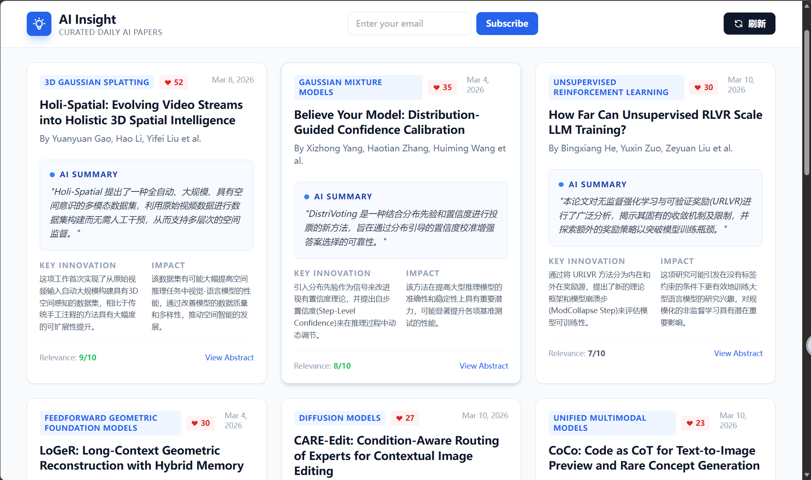
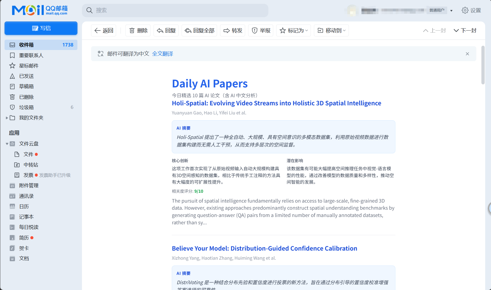

## 项目简介

本项目是一个面向 AI 研究爱好者的「每日论文阅读助手」。
它会从 HuggingFace 获取最新的 AI 相关论文，由后端调用 OpenAI GPT-4o 自动生成中文摘要和要点，帮助你快速浏览当天值得关注的工作，并支持邮件订阅和后台管理订阅者。

### 网页端效果



### 邮件端效果



### 功能概览

- 从 HuggingFace 获取每日论文，按 upvotes 降序排列
- GPT-4o 自动生成中文摘要、关键创新点、潜在影响与相关性评分
- 按 arXiv 分类订阅，只收到感兴趣方向的论文
- 每日邮件推送，支持 Gmail / Outlook 一键退订
- 管理后台：查看订阅者、发送测试邮件、查看发送日志

---

## 环境变量配置

在项目根目录创建 `.env` 或 `.env.local` 文件（`.env.local` 会覆盖 `.env` 中的同名变量）。

```bash
# ==================== 论文数据源 ====================
# HF_API_BASE=https://hf-mirror.com   # 国内镜像（可选）
# HTTPS_PROXY=socks5://127.0.0.1:1080 # 代理（可选）

# ==================== OpenAI API ====================
OPENAI_API_KEY=你的_OpenAI_API_Key
# OPENAI_BASE_URL=https://api.openai.com  # 第三方兼容接口（可选）

# ==================== 邮件服务（SMTP） ====================
# 不配置则以「模拟模式」将邮件输出到控制台
SMTP_HOST=smtp.example.com
SMTP_PORT=587
SMTP_USER=你的_SMTP用户名
SMTP_PASS=你的_SMTP密码
SMTP_FROM="AI Insight <no-reply@ai-insight.com>"

# ==================== 管理员认证 ====================
ADMIN_USERNAME=admin
ADMIN_PASSWORD=请修改为强密码
ADMIN_SESSION_SECRET=请使用一个很长且随机的字符串

# ==================== 安全配置（可选） ====================
# UNSUBSCRIBE_SECRET=独立的随机字符串
# CONFIRM_SECRET=独立的随机字符串
BASE_URL=https://your-domain.com   # 用于生成退订/确认链接，务必配置

# ==================== 定时任务（可选） ====================
# FETCH_CRON_SCHEDULE=0 1 * * *         # UTC 1:00 AM
# FETCH_RETRY_INTERVAL_MINUTES=10
# FETCH_RETRY_DEADLINE_HOUR=4

# ==================== 性能 / 路径（可选） ====================
# EMAIL_CONCURRENCY=5
# SUBSCRIBERS_FILE=/data/subscribers.json
# EMAIL_LOG_PATH=/data/email-send-log.jsonl
```

### 环境变量速查表

| 变量 | 必填 | 默认值 | 说明 |
|------|------|--------|------|
| `OPENAI_API_KEY` | **是** | 无 | OpenAI API 密钥 |
| `BASE_URL` | 建议配置 | `http://localhost:3001` | 服务公网 URL |
| `SMTP_HOST` | 否 | 无 | 不配置则邮件输出到控制台 |
| `ADMIN_PASSWORD` | 否 | `change_me_123` | **务必修改** |
| `ADMIN_SESSION_SECRET` | 否 | 内置弱密钥 | **务必修改** |
| `FETCH_CRON_SCHEDULE` | 否 | `0 1 * * *` | 定时任务 cron（UTC） |
| `EMAIL_CONCURRENCY` | 否 | `5` | 批量发送并发数 |
| `SUBSCRIBERS_FILE` | 否 | `server/subscribers.json` | 订阅者数据文件路径 |

---

## 使用方法

### 本地运行

```bash
npm install
npm run dev
```

- 用户界面：`http://localhost:3000/`
- 管理后台：`http://localhost:3000/admin`

### 其他命令

```bash
npm run server    # 仅启动后端
npm run build     # 构建前端生产版本
npm run preview   # 预览生产构建
```

---

## 部署指南

### 1. 构建前端

```bash
npm install && npm run build
```

产物输出到 `dist/`，确保 `/` 和 `/admin` 路径都 fallback 到 `index.html`。

### 2. 启动后端

```bash
npm run server
```

生产环境推荐使用 `pm2`：

```bash
pm2 start "npm run server" --name ai-insight-server
```

### 3. Nginx 反向代理

```
/ → dist/（静态资源）
/api/* → http://localhost:3001/api/*
```

### 4. 数据备份

只需定期备份 `server/subscribers.json`（论文缓存会自动重新生成）。
可设置 `SUBSCRIBERS_FILE=/path/to/subscribers.json` 指定自定义路径（适合 Docker 挂载持久化卷）。

### 5. 部署检查清单

- [ ] `npm run build` 成功，`dist/` 已部署
- [ ] `.env` 已配置，`ADMIN_PASSWORD`、`ADMIN_SESSION_SECRET`、`OPENAI_API_KEY`、`BASE_URL` 均已填写
- [ ] 后端启动，`/api/papers` 能返回数据
- [ ] `/admin` 可正常登录
- [ ] （可选）SMTP 配置后，订阅确认邮件、每日邮件、退订链接均正常
- [ ] （可选）配置域名 SPF / DKIM / DMARC 提高邮件到达率
